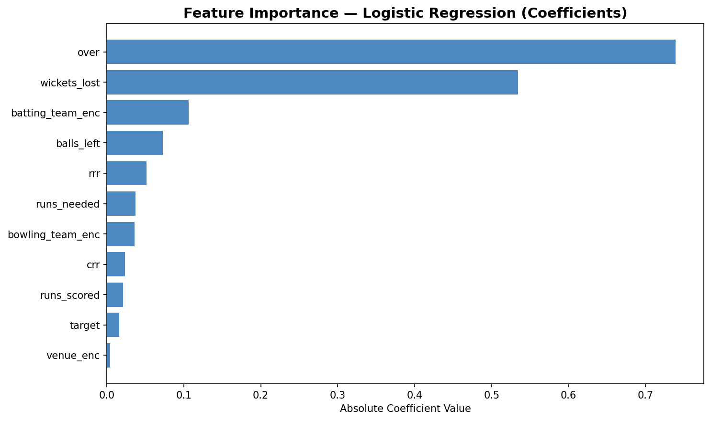

# 🏏 IPL Win Predictor — Live ML App

[](https://ipl-win-predictor-azam.streamlit.app)

## 🎯 Overview
A real-time IPL match win probability predictor built using machine learning
trained on 17 years of IPL data (2008–2024). Enter the current match situation
and instantly get the win probability for both teams.

---

## 🖥️ Live App
👉 **[Try it here]([https://ipl-win-predictor-azam.streamlit.app](https://azam-ipl-win-predictor.streamlit.app/))**


---

## 🔍 Problem Statement
Can we predict which team will win an IPL match in real time based on the
current match situation — runs scored, wickets lost, overs remaining,
and required run rate?

---

## 📦 Dataset
- **Source:** Kaggle — IPL Complete Dataset (2008–2024)
- **Matches:** 1,095 matches across 17 IPL seasons
- **Deliveries:** 260,920 ball-by-ball records
- **Features engineered:** 11 match-state features per over snapshot

---

## 🛠️ Tools & Technologies
| Tool | Purpose |
|---|---|
| Python | Data processing, feature engineering, model training |
| Pandas, NumPy | Data manipulation and feature creation |
| Scikit-learn | Model training and evaluation |
| Plotly | Interactive charts in the app |
| Streamlit | Live web application |
| Streamlit Cloud | Free deployment with public URL |
| Git/GitHub | Version control and deployment |

---

## ⚙️ How It Works

### Feature Engineering
For every match, we built a snapshot at the end of each over in the
second innings with these features:

| Feature | Description |
|---|---|
| `batting_team` | Team currently batting |
| `bowling_team` | Team currently bowling |
| `venue` | Match venue |
| `target` | Runs needed to win |
| `over` | Current over number |
| `runs_scored` | Total runs scored so far |
| `wickets_lost` | Wickets fallen so far |
| `runs_needed` | Runs still needed |
| `balls_left` | Balls remaining |
| `crr` | Current run rate |
| `rrr` | Required run rate |

### Model Selection
Trained and compared 3 models:

| Model | Accuracy | ROC-AUC |
|---|---|---|
| **Logistic Regression** | **82.05%** | **0.9091** ✅ |
| Gradient Boosting | 82.01% | 0.9003 |
| Random Forest | 78.73% | 0.8807 |

Logistic Regression selected as final model based on highest ROC-AUC score.

### Key Finding
> Over number was the strongest predictor (coefficient: 0.74), outweighing
> required run rate — suggesting the stage of the innings captures pressure
> better than raw run requirements alone.

---

## 📊 Feature Importance


---

## 🚀 Run Locally

```bash
# Clone the repo
git clone https://github.com/azam-1125/ipl-win-predictor.git
cd ipl-win-predictor

# Install dependencies
pip install -r requirements.txt

# Run the app
streamlit run app/app.py
```

---

## 📁 Project Structure

- **app/** — Streamlit web app
  - app.py
- **data/**
  - raw/ — Original Kaggle CSVs (matches.csv, deliveries.csv)
  - processed/ — Engineered features and charts
- **model/** — Trained model and encoders
  - ipl_model.pkl
  - le_batting.pkl, le_bowling.pkl, le_venue.pkl
  - teams.json, venues.json
- **notebooks/**
  - eda.ipynb — Full EDA and model training
- requirements.txt
- README.md
---

## 💡 Sample Predictions

| Situation | Batting Team | Win Probability |
|---|---|---|
| Need 60 from 60 balls, 1 wicket down | Mumbai Indians | 86.9% ✅ |
| Need 120 from 30 balls, 7 wickets down | Rajasthan Royals | 0.1% 🚨 |
| Need 35 from 24 balls, 4 wickets down | RCB | 39.6% ⚔️ |

---

## 🔮 Future Improvements
- Add player-level features (top batsman still in, bowler form)
- Incorporate recent team form (last 5 matches)
- Add historical head-to-head stats
- Extend to predict final score in first innings

---

## 👤 Author
**Shaik Azam Hussain**
- 📧 shaikazam1125@gmail.com
- 💼 [LinkedIn](https://linkedin.com)
- 🐙 [GitHub](https://github.com/azam-1125)
